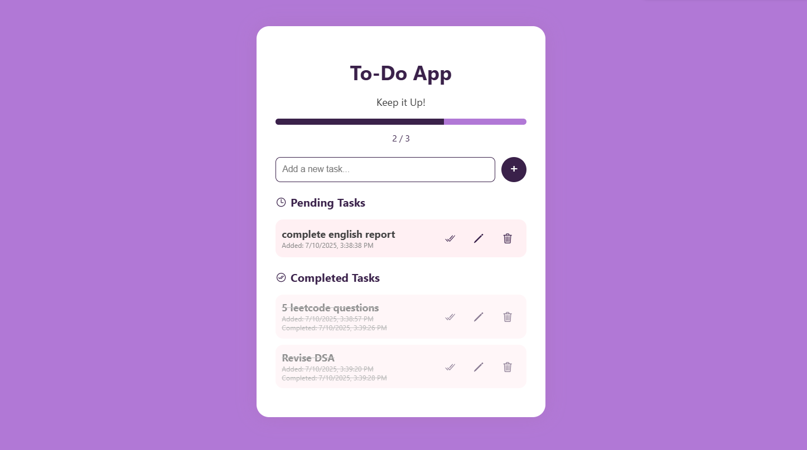

# OIBSIP_WebDevelopment_Task3
Task 3 of level 2 under Oasis Infobyte Internship Program
[ Basic Todo WebApp ]

## Objective
Develop a web-based To-Do app that helps users manage their daily tasks effectively by allowing task addition, completion tracking, editing, and deletion, with timestamp tracking.

## Tools Used
- HTML5
- CSS3
- JavaScript (Vanilla JS)
- Visual Studio Code

## Features Implemented

### Add New Tasks
- Users can enter a new task using an input field and click ** + button** to insert it into the list.
- Each task is timestamped with the date and time of creation.

### Task States: Pending vs. Completed
- Tasks are shown in two sections:
  - **Pending Tasks**
  - **Completed Tasks**
- A task can be marked as complete using a checkbox or button. Once marked, it's moved to the "Completed Tasks" section and timestamped with the completion time.

### Edit and Delete Tasks
- Each task (in either list) includes:
  - An **Edit** button to modify the task description.
  - A **Delete** button to remove the task permanently.

### Timestamps
- Both "task added" and "task completed" times are stored and displayed below the task.

## Steps Performed

1. Designed the structure using **semantic HTML** elements for clarity.
2. Styled the app with **CSS** for a clean, responsive layout.
3. Wrote **JavaScript logic** to:
   - Add tasks with timestamps
   - Move tasks between "Pending" and "Completed"
   - Edit task names inline
   - Delete tasks from either list
4. Used JavaScript **Date object** to handle task time tracking.
5. Ensured real-time UI updates using DOM manipulation.

## Outcome
A working To-Do web application where users can:
- Add tasks
- View tasks under **Pending** or **Completed**
- Edit or delete any task
- See date and time when tasks were added/completed
- Enjoy a responsive and user-friendly interface

## Screenshot

